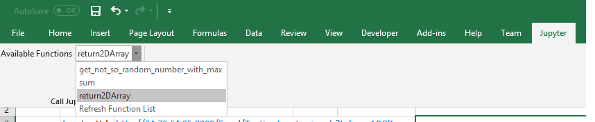

# jupyterexcel Package

This is a package to make Jupyter.ipynb file a web api with json result. You can call Jupyter from Excel Formula or Ribbon CallBack Functions
SourceCode in  [JupyterExcel](https://github.com/luozhijian/jupyterexcel)

This Jupyter Excel web api can be connected with Excel addin which call this web api. Excel formula will generate a web api url and through winhttp to get json result.

## Installation 

    pip install jupyterexcel

then run 

    jupyter serverextension enable --py jupyterexcel

## Server setting

Please config [jupyter server](https://jupyter-notebook.readthedocs.io/en/stable/public_server.html) like the following:
```
c.NotebookApp.token = 'ABCD'   #it is good to use token mode for web api call to pass through
c.NotebookApp.allow_remote_access = True  #if you like to set to access from other computer
```
## Example
The following screenshot shows the sample notebook file with a function sum. You can download TestingJupyter.ipynb or create your own.  The following is an instance I hosted in google cloud platform, you can open and add a function of yours.
'''
http://34.73.64.35:8888/Excel/TestingJupyter.ipynb?token=ABCD&functionname=sum&1=11&2=8&3=6
http://34.73.64.35:8888/notebooks/TestingJupyter.ipynb
'''


The following screenshot shows how excel Formula works. 


The following screenshot Shows how Ribbon Call Back function works

 

## Future Development Plan
1. Make Excel client side more easier to use, such as generate Excel formula proxy
2. Able to support R, Julia ....

## Reference 
read some code from [appmode](https://github.com/oschuett/appmode)
