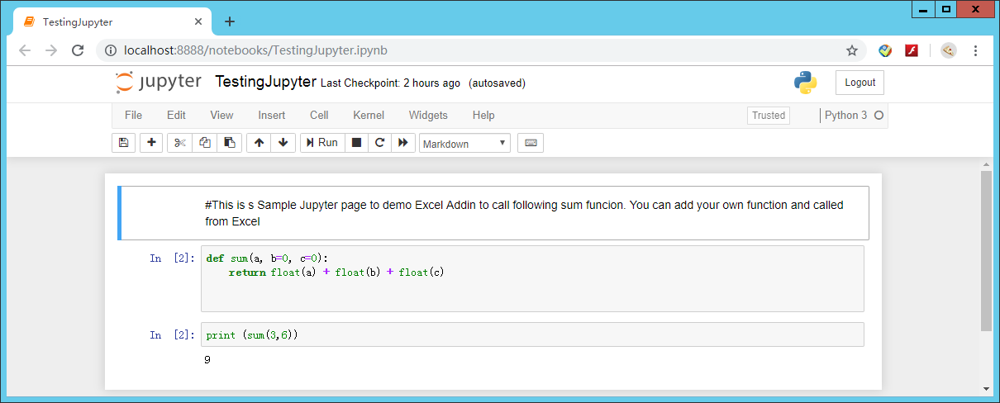
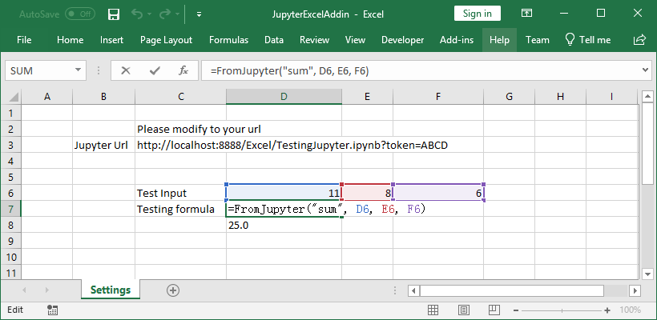

# jupyterexcel Package

This is a package to make Jupyter.ipynb file a web api with json result. 
SourceCode in  [JupyterExcel](https://github.com/luozhijian/jupyterexcel)

This Jupyter Excel web api can be connected with Excel addin which call this web api. Excel formula will generate a web api url and thorugh winhttp to get json result.

## Installation 

    pip install jupyterexcel

then run 

    jupyter serverextension enable --py --sys-prefix jupyterexcel

## Server setting

Please config [jupyter server](https://jupyter-notebook.readthedocs.io/en/stable/public_server.html) like the following:
```
c.NotebookApp.token = 'ABCD'   #it is good to use token mode for web api call to pass through
```
## Example
The following screenshot shows the sample notebook file with a function sum. You can download TestingJupyter.ipynb or create your own. 
http://localhost:8888/Excel/TestingJupyter.ipynb?token=ABCD&functionname=sum&1=11&2=8&3=6

 

The following screenshot shows how excel works


## Future Development Plan
1. Make jupyterexcel can take Post call for large data from Excel 
2. Make Excel client side more easier to use, such as generate Excel formula proxy
3. Possible add ribbon in Excel and call into Jupyter function with button click

## Reference 
read some code from [appmode](https://github.com/oschuett/appmode)
